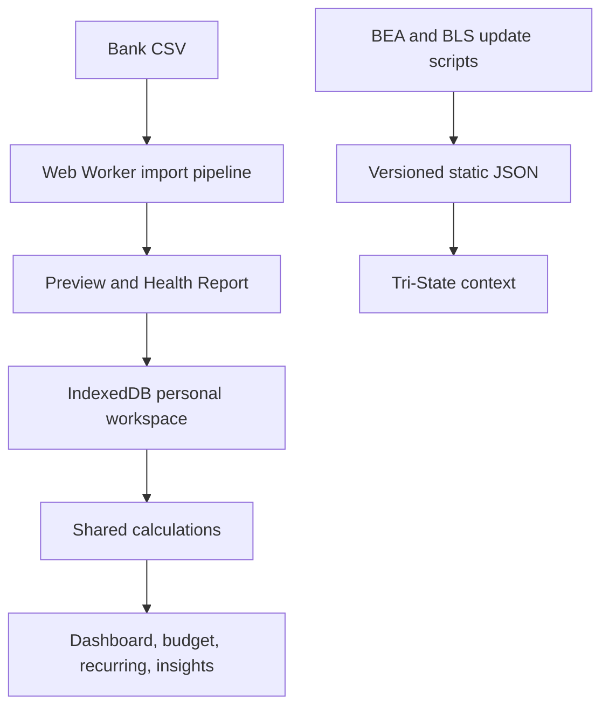

# Tri-State Spending Lens — Master Product and Build Plan

**Revision date:** July 31, 2026  
**Product stage:** Pre-development specification  
**Recommended release:** Privacy-first browser application, version 1.0

## 1. Executive decision

Tri-State Spending Lens should be built as a local-first financial analysis and budgeting website for students and young adults in New Jersey, New York, and Pennsylvania.

The strongest version of the idea is not just a CSV dashboard and not a generic budgeting app. It combines three things:

1. **Personal analysis:** clean and understand bank transactions.
2. **Practical planning:** create monthly category budgets and savings targets.
3. **Regional context:** explore trustworthy NJ, NY, and PA cost and spending data without presenting state averages as personal rules.

The core product loop is:

> **Import → Clean → Understand → Plan → Review**

The personal transaction pipeline and public economic-data pipeline must remain technically separate. Personal files never leave the browser. Government data is collected during development, converted to versioned static JSON, and shipped with the site.

## 2. Important revisions to the original plan

The original plan had the correct privacy model and technology direction. Version 1.0 should make these changes:

| Change | Decision | Why it improves the product |
| --- | --- | --- |
| Budgeting | Move lightweight monthly budgeting into the MVP | Analysis is more useful when the user can act on it |
| Savings planning | Add an optional monthly savings target | Gives income and cash-flow data a clear purpose |
| Import quality | Add an Import Health Report and one-click import rollback | Bad imports are the largest threat to trust |
| Backup | Add local workspace backup and restore | IndexedDB can be cleared or evicted; local-first must not mean fragile |
| Insights | Add transparent rule-based insights | Makes the app feel intelligent without sending transactions to AI |
| Recurring costs | Add annualized cost, expected next date, and price-change flags | More useful than a plain subscription list |
| Context | Add a “What does $100 feel like?” RPP lens | Turns regional price data into an understandable comparison |
| Performance | Parse and normalize large files in a Web Worker | Prevents the interface from freezing during imports |
| Categories | Replace “Luxury” with neutral Shopping and Personal Care categories | Avoids subjective or judgmental classification |
| Data resilience | Add schema versions, migrations, import sessions, and stable fingerprints | Prevents future updates from corrupting user data |
| Scope control | Keep goals, encrypted backup, PWA, and bank-specific presets for v1.1 | Keeps the first release achievable and testable |

## 3. Product definition

> **Tri-State Spending Lens is a privacy-first financial analysis and budgeting website for students and young adults in New Jersey, New York, and Pennsylvania. Users import bank CSV files, review and categorize transactions, understand spending and recurring costs, create a monthly plan, and explore regional economic context—all without connecting a bank account or uploading financial data to a server.**

### Primary audience

- Students and young adults, approximately ages 16–25
- People with one or several checking or credit-card CSV exports
- People who want a simple view of their money without granting bank access
- NJ, NY, and PA residents interested in local economic context

### Jobs to be done

- “Show me where my money actually went.”
- “Help me clean up confusing bank descriptions.”
- “Tell me which subscriptions and repeated payments I may be overlooking.”
- “Help me set a realistic monthly spending plan.”
- “Show whether I am on pace to exceed that plan.”
- “Explain how price levels and inflation differ around the tri-state region.”

### Product principles

1. **Private by architecture:** personal data stays in the browser.
2. **Trust before cleverness:** every total must be explainable and reproducible.
3. **Review before analysis:** questionable imports must be surfaced before charts appear.
4. **Neutral language:** describe behavior without shaming the user.
5. **Context, not commands:** regional statistics inform; they do not prescribe a personal budget.
6. **Useful without an account:** demo mode and local persistence provide the full core experience.

## 4. Non-goals for version 1.0

Do not add any of the following to the first release:

- Plaid or bank-account connections
- User accounts, authentication, Supabase, or a server database
- AI or LLM access to transaction descriptions
- Credit scores, investments, brokerage data, or tax calculations
- Personalized financial-product recommendations
- Claims that a state average is the “correct” amount for a user to spend
- Multi-currency support; v1 supports USD only
- Household collaboration or syncing across devices
- A full zero-based/envelope accounting system

## 5. Privacy and trust model

### Non-negotiable requirements

- CSV parsing, normalization, categorization, and calculations occur in the browser.
- The original CSV file is not stored as a blob after import.
- Normalized transactions are stored only in IndexedDB for the site’s origin.
- No transaction descriptions, amounts, categories, budgets, or account labels are sent in network requests.
- No third-party advertising, session replay, crash-reporting, or behavioral analytics scripts run inside the app.
- Fonts and icons are bundled or self-hosted.
- Personal transaction data never appears in URL parameters, page titles, console logs, or error reports.
- A visible **Delete all data** control requires confirmation and reports completion.
- A **Download workspace backup** control exports the local database in a versioned JSON format.
- A **Restore workspace backup** flow validates the schema before changing existing data.
- The app warns that clearing site data, using private browsing, or changing domains can remove locally stored data.
- The app honestly states that IndexedDB is local storage, not encrypted vault storage. Anyone with access to the same unlocked browser profile may be able to inspect it.

IndexedDB is appropriate because it supports structured browser-local data and is isolated by origin. Browser storage is still subject to quotas and possible eviction, so backup/restore and an optional persistent-storage request should be part of the product—not an afterthought. See [MDN IndexedDB](https://developer.mozilla.org/en-US/docs/Web/API/IndexedDB_API) and [MDN storage quotas and eviction](https://developer.mozilla.org/en-US/docs/Web/API/Storage_API/Storage_quotas_and_eviction_criteria).

### Network boundary

The deployed app should work under a restrictive Content Security Policy. The application pages should not need external API calls. Static economic JSON and application assets are served from the same origin.

In development and tests, add a network-boundary test that imports a synthetic CSV, edits transactions, creates a budget, and verifies that no request contains personal data.

## 6. Information architecture

### Public routes

| Route | Purpose |
| --- | --- |
| `/` | Landing page, privacy promise, product preview, demo/import calls to action |
| `/context` | NJ/NY/PA economic context |
| `/methodology` | Calculation, categorization, recurring, and public-data methods |
| `/privacy` | Technical privacy model and local-data controls |

### Application routes

| Route | Purpose |
| --- | --- |
| `/import` | Import wizard and import history |
| `/app/overview` | Financial overview and current-month status |
| `/app/transactions` | Search, review, categorize, and exclude transactions |
| `/app/budget` | Monthly overall/category budgets and savings target |
| `/app/recurring` | Possible recurring charges, annualized cost, and expected dates |
| `/app/insights` | Transparent rule-based observations and month-in-review |
| `/app/settings` | Accounts, merchant rules, backup/restore, storage, and delete controls |

### Main navigation

- **Overview**
- **Transactions**
- **Budget**
- **Recurring**
- **Insights**
- **Tri-State Context**

Import and Settings should be utility actions rather than permanent primary-navigation competitors.

## 7. Core user experience

### 7.1 Landing and onboarding

The landing page should answer four questions within the first screen:

1. What does this do?
2. Is my bank data uploaded?
3. What will I learn?
4. Can I try it without using my real data?

Recommended headline:

> **See where your money goes—without sending it anywhere.**

Primary actions:

- **Try the demo**
- **Import a bank CSV**

Demo mode uses obviously fictional, realistic transactions spanning at least four complete months. It should support every core feature, including budgets and recurring charges. A “Reset demo” action restores the original synthetic dataset.

On first real import, ask only for information needed to improve the experience:

- Optional home state: NJ, NY, PA, or none
- Preferred week start
- Whether credits in the file represent income/refunds

Never use IP geolocation or hidden location detection.

### 7.2 Import wizard

The import wizard should use six steps:

1. **Choose files:** one or more `.csv` files; show privacy reminder and size limit.
2. **Identify format:** detect delimiter, encoding, header row, and likely bank layout.
3. **Map columns:** date, description, amount or debit/credit, optional account and type.
4. **Confirm conventions:** sign direction, date format, account label/type, and statement range.
5. **Review preview:** show normalized rows and all warnings before saving.
6. **Import Health Report:** summarize accepted, rejected, duplicated, questionable, and uncategorized rows.

Required formats:

```text
Date | Description | Amount
```

```text
Date | Description | Debit | Credit
```

Important behaviors:

- Treat every import as an atomic `ImportSession`; either it commits fully or not at all.
- Allow an entire import session to be rolled back later.
- Save column mappings locally as optional presets, but never identify a bank unless the user names it.
- Detect likely duplicates but ask before excluding ambiguous ones. Two identical purchases on the same day can be legitimate.
- Reject invalid dates and nonnumeric amounts rather than silently converting them to zero.
- Preserve the original row number and description for auditability.
- Show how positive and negative values will be interpreted before commit.
- Parse large files in a Web Worker so the UI remains responsive. [MDN Web Workers](https://developer.mozilla.org/en-US/docs/Web/API/Web_Workers_API/Using_web_workers)

Initial limits should be explicit and easy to revise:

- CSV only
- 10 MB maximum per file
- 100,000 rows maximum per import session
- USD only

### 7.3 Transaction review

The transaction table should support:

- Search by raw description or normalized merchant
- Date, account, kind, category, tag, and inclusion filters
- Sort and accessible pagination or virtualization
- Category and merchant edits
- Mark as transfer, refund, income, card payment, fee, or cash withdrawal
- Include/exclude from spending totals
- Optional note and user tags
- Multi-select bulk edits
- Undo for recent edits
- Export filtered or full cleaned CSV
- Permanent access to the original description

When a user changes a merchant or category, offer two distinct actions:

- **Change this transaction only**
- **Create a rule for similar future transactions**

This prevents one edit from unexpectedly rewriting the full history.

### 7.4 Permanent category system

Use stable, neutral categories:

- Housing
- Utilities & Bills
- Groceries
- Dining
- Transportation
- Subscriptions & Memberships
- Shopping
- Personal Care
- Entertainment
- Health
- Education
- Travel
- Fees & Interest
- Gifts & Donations
- Cash & ATM
- Other

Separately classify the transaction kind:

- Purchase
- Refund
- Income
- Transfer
- Credit-card payment
- Fee
- Cash withdrawal
- Unknown

Separately classify budget behavior:

- Essential or discretionary
- Fixed or variable

The behavior classification must be editable because the same category can mean different things for different people.

### 7.5 Overview dashboard

The default view should be the current month, with an easy switch to previous month, last 90 days, year to date, or custom range.

Summary cards:

- Net spending
- Money in
- Net cash flow
- Budget remaining
- Savings rate, when valid income data exists
- Largest category
- Possible recurring monthly cost
- Transactions analyzed

Charts and panels:

- Monthly net-spending trend
- Category breakdown
- Budget versus actual by category
- Top merchants
- Fixed versus variable spending
- Essential versus discretionary spending
- Weekday or calendar pattern
- Recent large or unusual purchases
- Data-quality status

All cards and charts must use a single shared calculation/selector layer so totals cannot disagree.

### 7.6 Budgeting — MVP scope

Budgeting should be intentionally simple:

- Overall monthly spending limit
- Optional category limits
- Optional monthly income target
- Optional monthly savings target
- Copy the previous month’s plan
- Edit a future month before it begins
- Budget-versus-actual progress bars
- Spending-pace indicator based on elapsed days
- Alerts shown inside the product only; no push notifications or email
- Rollover is **off** in v1.0

The budget should still work if no income data is imported. In that case, hide cash-flow and savings-rate claims and focus on spending limits.

Useful budget messages:

- “You have used 62% of your Dining budget with 48% of the month elapsed.”
- “At your current pace, this category may exceed its plan by about $34.”
- “Your plan leaves $210 between expected income and planned spending.”

Avoid moral language such as “bad spending” or “wasteful.”

### 7.7 Recurring expenses

A recurring series is a suggestion, not a fact. Detection should consider:

- Same normalized merchant or user-created merchant rule
- At least three occurrences when possible
- Similar amounts within an explainable tolerance
- Weekly, biweekly, monthly, quarterly, or annual cadence
- Date drift for weekends and billing cycles

Display:

- Merchant
- Likely cadence
- Typical amount or amount range
- Last charge
- Expected next charge
- Estimated annualized cost
- Price-change flag
- Confidence label: high, medium, or low

User controls:

- Confirm recurring
- Mark not recurring
- Merge or split a detected series
- Change category
- Exclude from recurring totals

Do not label every recurring expense a subscription. Rent, insurance, and utilities are recurring but not subscriptions.

### 7.8 Transparent insights

The Insights page should use deterministic local rules, not AI. Every insight must include a “Why am I seeing this?” explanation and a link to the supporting transactions.

High-value insight cards:

- **Spending pace:** current spending versus elapsed portion of the month
- **Category shift:** change versus the previous complete month
- **Recurring annualizer:** estimated yearly cost of confirmed and likely recurring payments
- **Price change:** a recurring merchant’s typical charge appears to have increased
- **Concentration:** unusually large share of spending at one merchant/category
- **Unusual purchase:** amount is far above that merchant/category’s recent typical range
- **Month in Review:** concise summary after a full month closes
- **Data warning:** conclusions may be incomplete because the import covers only part of a month

Minimum evidence rules matter. For example, do not show a month-over-month percentage when either month is incomplete, and do not call a transaction unusual without a sufficient comparison history.

### 7.9 Tri-State context

The context section is explanatory and should never silently blend into personal totals.

Version 1.0 should contain four focused views:

1. **Spending by state:** per-capita personal consumption expenditures for NJ, NY, and PA.
2. **Category mix:** selected state PCE categories with a documented crosswalk.
3. **Price-level lens:** Regional Price Parities for the three states.
4. **Inflation trend:** New York–Newark–Jersey City and Philadelphia–Camden–Wilmington CPI trends, labeled by their actual metro geographies.

Add one memorable educational feature:

### “What does $100 feel like?”

Use BEA RPP values to illustrate relative purchasing power:

```text
National-price-equivalent purchasing power = $100 × (100 / RPP)
```

This is an educational approximation, not a quote for a specific basket or city. The interface must explain that state RPP includes broad consumption prices and housing rents.

Each public-data chart must display:

- Source organization
- Dataset and series/table identifier
- Geography
- Unit
- Frequency
- Observation period
- Release/update date
- Link to the source
- Short limitation note

Current source plan as of July 31, 2026:

- BEA state PCE currently covers 2024; the next scheduled state PCE release is September 30, 2026. [BEA Consumer Spending by State](https://www.bea.gov/data/consumer-spending/state)
- BEA RPP provides comparable state and metro price levels; 2024 is the current annual observation. [BEA Regional Price Parities](https://www.bea.gov/data/prices-inflation/regional-price-parities-state-and-metro-area)
- BLS provides metro CPI for New York–Newark–Jersey City, NY–NJ–PA and Philadelphia–Camden–Wilmington, PA–NJ–DE–MD. [BLS CPI metro chart](https://www.bls.gov/charts/consumer-price-index/consumer-price-index-by-metro-area.htm)

Do not present New Jersey as having a standalone statewide CPI; it does not. Do not compare a single user’s category share to BEA PCE as if the definitions and households are equivalent.

## 8. Calculation contract

Calculation rules must be documented and unit-tested before building charts.

### Included in net spending

- Included purchase debits
- Included fee debits
- Included cash withdrawals
- Minus included refunds

### Excluded from net spending by default

- Income
- Transfers between accounts
- Credit-card payments
- Transactions explicitly excluded by the user
- Unknown credits until reviewed

### Core formulas

```text
Net spending = included purchase/fee/cash debits − included refunds

Net cash flow = included income − net spending

Savings rate = (included income − net spending) / included income

Budget remaining = budget limit − budget-period net spending
```

Savings rate is undefined when included income is zero or when the user marks the imported income data as incomplete. A negative savings rate is allowed and should be displayed honestly.

### Refund policy

When possible, a refund inherits the matched purchase’s merchant and category and reduces net spending inside the selected period. If a refund cannot be matched, the user reviews its category. The dashboard should allow inspection of both gross outflow and refunds even when the main card shows net spending.

### Monthly averages

Default monthly averages use complete calendar months only. If the user explicitly selects a custom range, label the result as a selected-period average. Never silently treat a partial month as complete.

## 9. Data model

Money is always stored as integer cents. Dates are stored as ISO calendar dates (`YYYY-MM-DD`) because bank CSVs usually provide posting dates without reliable time zones.

```ts
type TransactionKind =
  | "purchase"
  | "refund"
  | "income"
  | "transfer"
  | "payment"
  | "fee"
  | "cash_withdrawal"
  | "unknown";

type ClassificationConfidence = "high" | "medium" | "low" | "none";

interface Transaction {
  id: string;
  fingerprint: string;
  importSessionId: string;
  originalRow: number;
  accountId: string;

  postedDate: string;
  descriptionRaw: string;
  merchantNormalized: string;

  amountCents: number;
  direction: "debit" | "credit";
  kind: TransactionKind;

  categoryId: string;
  categorySource: "user_rule" | "merchant_rule" | "keyword_rule" | "user" | "uncategorized";
  classificationConfidence: ClassificationConfidence;

  essentiality?: "essential" | "discretionary";
  variability?: "fixed" | "variable";
  tags: string[];
  note?: string;

  excludedFromSpending: boolean;
  exclusionReason?: string;
  createdAt: string;
  updatedAt: string;
}
```

The `fingerprint` supports duplicate detection but is not a guaranteed unique transaction ID. A duplicate candidate group should consider account, date, direction, amount, normalized description, and repeated occurrence index so legitimate same-day purchases are not automatically deleted.

```ts
interface ImportSession {
  id: string;
  importedAt: string;
  sourceFileNames: string[];
  accountIds: string[];
  mappingVersion: number;
  rowCount: number;
  acceptedCount: number;
  rejectedCount: number;
  duplicateCandidateCount: number;
  warnings: string[];
}

interface Account {
  id: string;
  label: string;
  type: "checking" | "savings" | "credit_card" | "cash" | "other";
  currency: "USD";
  archived: boolean;
}

interface MerchantRule {
  id: string;
  matchType: "exact" | "contains" | "starts_with";
  pattern: string;
  normalizedMerchant?: string;
  categoryId?: string;
  kind?: TransactionKind;
  priority: number;
  createdByUser: boolean;
}

interface BudgetPlan {
  id: string;
  month: string; // YYYY-MM
  overallLimitCents?: number;
  incomeTargetCents?: number;
  savingsTargetCents?: number;
  copiedFromMonth?: string;
  rolloverEnabled: false;
}

interface BudgetCategoryTarget {
  id: string;
  budgetPlanId: string;
  categoryId: string;
  limitCents: number;
}
```

Economic observations need monthly and annual periods, not only a numeric year:

```ts
interface EconomicObservation {
  geographyCode: string;
  geographyLabel: string;
  geographyType: "state" | "metro" | "region" | "nation";
  measureCode: string;
  measureLabel: string;
  categoryCode?: string;
  categoryLabel?: string;
  frequency: "monthly" | "bimonthly" | "annual";
  period: string;
  value: number;
  unit: string;
  sourceName: "BEA" | "BLS";
  sourceSeriesOrTable: string;
  sourceUrl: string;
  releasedAt: string;
  snapshotGeneratedAt: string;
}
```

The database also needs `RecurringSeries`, `UserEdit`, `AppSetting`, and `SchemaMigration` tables. User edits and merchant rules should be stored separately enough that re-running a better normalization algorithm does not erase manual decisions.

## 10. Categorization and recurring logic

### Rule precedence

1. Explicit per-transaction user edit
2. User-created merchant rule
3. Exact built-in merchant alias
4. Built-in keyword rule
5. Uncategorized/Other review queue

Use confidence labels, not unexplained decimals. The methodology page should show the matched rule and why it applied.

### Merchant normalization

Normalization may:

- Trim whitespace and normalize casing
- Remove known card-network prefixes
- Remove store numbers only when a rule is safe
- Preserve the raw description permanently
- Apply versioned aliases

Normalization must not guess aggressively. “SQ *GREEN HOUSE” and “GREEN HOUSE RENTALS” should not be merged merely because they share words.

### Recurring confidence

Confidence should be derived from occurrence count, interval consistency, merchant match quality, and amount stability. Avoid pretending that a single mathematical threshold is certain. Tests should cover month lengths, weekends, leap years, variable utilities, annual charges, and missed months.

## 11. Public-data pipeline

Do not call BEA or BLS from each visitor’s browser.

Use development scripts to:

1. Retrieve official data.
2. Save the raw response in a temporary, git-ignored location.
3. Validate expected series, units, geography, periods, and observation counts.
4. Normalize the required observations.
5. Write small versioned JSON snapshots.
6. Write a metadata file with source URLs, retrieval time, release date, checksums, and script version.
7. Run data-contract tests before committing snapshots.

The BLS API returns observations but has metadata limitations, so keep an explicit reviewed registry of series IDs and human-readable labels. [BLS Public Data API features](https://www.bls.gov/bls/api_features.htm)

Recommended files:

```text
src/data/economic/
├── bea-pce-state-2024.json
├── bea-real-pce-state-2024.json
├── bea-rpp-state-2024.json
├── bls-ny-metro-cpi.json
├── bls-philadelphia-metro-cpi.json
├── series-registry.json
└── metadata.json
```

Only synthetic transaction fixtures may enter Git. Raw personal CSV files must never be committed.

## 12. Technical architecture

### Recommended stack

- React + TypeScript
- Vite 8
- React Router
- Tailwind CSS v4 through the official Vite plugin
- Radix primitives or carefully built accessible components; avoid a generic template look
- Papa Parse for CSV parsing
- Zod for runtime validation and backup/import schemas
- Dexie and `dexie-react-hooks` for IndexedDB
- TanStack Table v8 stable for the transaction grid; do not use the v9 beta for the MVP
- Recharts for charts
- date-fns for date calculations
- React Hook Form for mapping and budget forms
- Web Workers for import normalization and expensive recalculation
- Vitest + React Testing Library for unit/component tests
- Playwright + `@axe-core/playwright` for end-to-end and accessibility tests

Vite remains a strong fit because the app is a static client application and does not need SSR or backend routes. Vite 8 requires Node.js 20.19+ or 22.12+. [Vite 8 release notes](https://vite.dev/blog/announcing-vite8) Tailwind’s current Vite integration uses `tailwindcss` with `@tailwindcss/vite`. [Tailwind Vite installation](https://tailwindcss.com/docs)

### State and calculation boundaries

- IndexedDB/Dexie is the source of truth for user data.
- Component state holds temporary UI state only.
- A shared selector/aggregation module computes every dashboard value.
- Import parsing/normalization is a pure pipeline with fixture tests.
- User edits are explicit commands that can be undone.
- Economic data is read-only static data with separate types and selectors.

Do not add Redux, React Query, a backend, or a global state library unless the implementation demonstrates a real need.

### Architecture



### Repository structure

```text
tri-state-spending-lens/
├── public/
│   ├── demo/
│   ├── fonts/
│   └── icons/
├── scripts/
│   └── update-economic-data/
├── src/
│   ├── app/
│   │   ├── router/
│   │   ├── providers/
│   │   └── layout/
│   ├── components/
│   │   ├── ui/
│   │   ├── charts/
│   │   └── data-display/
│   ├── features/
│   │   ├── import/
│   │   ├── transactions/
│   │   ├── categorization/
│   │   ├── dashboard/
│   │   ├── budget/
│   │   ├── recurring/
│   │   ├── insights/
│   │   ├── context/
│   │   └── privacy/
│   ├── data/
│   │   ├── demo/
│   │   └── economic/
│   ├── db/
│   │   ├── schema/
│   │   ├── migrations/
│   │   └── repositories/
│   ├── workers/
│   ├── calculations/
│   ├── lib/
│   ├── pages/
│   ├── styles/
│   └── types/
├── tests/
│   ├── fixtures/
│   ├── unit/
│   ├── integration/
│   └── e2e/
├── docs/
│   ├── product-spec.md
│   ├── privacy-model.md
│   ├── data-methodology.md
│   ├── calculation-contract.md
│   ├── category-rules.md
│   └── threat-model.md
├── package.json
├── vite.config.ts
└── vercel.json
```

## 13. Design direction

The visual target is a calm financial-research tool—not a neon fintech app and not a childish budgeting game.

### Visual system

- Deep navy ink for primary text and navigation
- Warm off-white canvas
- NJ teal, NY blue, and PA amber as contextual accents
- Green and red reserved mainly for positive/negative financial states
- Tabular numerals for money
- Thin map/grid/lens motifs used sparingly
- Medium-radius cards; avoid excessive pill shapes
- Subtle shadows and restrained motion
- Self-hosted, highly legible typeface

### Chart requirements

- Never rely on color alone
- Direct labels where practical
- Accessible data-table alternative
- Tooltips usable by keyboard
- Clear units and date ranges
- No 3D charts, gauges, or decorative chartjunk
- Motion respects `prefers-reduced-motion`

### Mobile behavior

- Summary and budget actions must work well on a phone.
- The transaction table may become a card list or controlled horizontal grid.
- Import mapping should be usable on mobile, though desktop may be recommended for very large files.

## 14. Security and data-quality requirements

- Sanitize and render descriptions as text, never HTML.
- Impose file-size, row-count, and field-length limits.
- Prevent spreadsheet formula injection on CSV export. OWASP notes cells beginning with formula-triggering characters require defensive handling. [OWASP CSV Injection](https://owasp.org/www-community/attacks/CSV_Injection)
- Use cryptographically strong random IDs and SHA-256 only for local fingerprints/checksums, not as a claim of encryption.
- Add a strict Content Security Policy and other static security headers.
- Do not use remote fonts, remote chart libraries, or dynamic script injection.
- Make import writes transactional.
- Validate backup schema and version before restore.
- Create migrations for every IndexedDB schema change.
- Escape or neutralize filenames on download.
- Keep synthetic malicious fixtures for HTML strings, long descriptions, formula-like fields, invalid Unicode, and malformed CSV.

## 15. MVP acceptance criteria

Version 1.0 is ready only when all of these are true:

### Import and data integrity

- Both amount-column and debit/credit-column CSVs import correctly.
- The user confirms sign interpretation before commit.
- Invalid rows are counted and explained.
- Duplicate candidates are surfaced without automatically deleting legitimate repeats.
- Rolling back an import removes only that session’s transactions.
- Reimporting the same fixture produces identical normalized results.

### Calculations

- Transfers and card payments are excluded by default.
- Refunds reduce net spending correctly.
- Checking and credit-card imports do not double count payments.
- Every dashboard value matches the calculation contract.
- Partial-month and incomplete-income warnings appear when required.

### Budget and recurring

- Overall and category budgets persist locally.
- Budget progress reacts immediately to transaction edits.
- Copy-previous-month works without linking the two plans.
- Recurring results display confidence and can be corrected by the user.
- Annualized recurring totals use the detected cadence correctly.

### Privacy and resilience

- No personal value appears in network requests or logs during the complete E2E flow.
- Delete all data clears transactions, budgets, rules, and settings.
- Backup then restore reproduces the workspace totals.
- Corrupt or future-version backups fail safely without changing current data.
- The app explains local-storage limitations.

### Quality

- Keyboard navigation works through import, transaction review, and budgeting.
- Automated accessibility testing finds no serious or critical violations.
- Core flows work at phone, tablet, and desktop widths.
- A 100,000-row synthetic import does not freeze the main UI thread.
- Empty, loading, error, partial-data, and demo states are designed.

## 16. Build roadmap

### Phase 0 — Foundation documents and decisions

Create and approve:

1. `product-spec.md`
2. `privacy-model.md`
3. `data-methodology.md`
4. `calculation-contract.md`
5. `category-rules.md`
6. `threat-model.md`

Also define ten representative synthetic CSV fixtures before writing the real parser.

**Exit condition:** no unresolved decisions about sign conventions, inclusion/exclusion, refunds, duplicate handling, or budget formulas.

### Phase 1 — Repository, design system, and shell

- Scaffold React/TypeScript/Vite
- Add linting, formatting, tests, and CI
- Add routes and responsive application shell
- Implement design tokens and core accessible components
- Add empty states and demo-data entry point
- Deploy a Vercel preview

**Exit condition:** every route exists, navigation works, mobile shell is solid, and CI is green. No real import logic yet.

### Phase 2 — Local database and demo workspace

- Create Dexie schema and first migration
- Implement repositories and shared calculation interfaces
- Add synthetic demo transactions, accounts, budgets, and recurring charges
- Implement reset demo, delete, and basic backup/restore

**Exit condition:** the complete UI can be built against stable local data contracts.

### Phase 3 — CSV import engine

- Web Worker parsing
- Encoding/header/delimiter detection
- Column mapping and sign confirmation
- Date and money normalization
- Preview, warnings, and Import Health Report
- Import sessions, duplicate candidates, atomic commit, and rollback

**Exit condition:** all fixture tests pass and the same input is deterministic.

### Phase 4 — Transaction review and rules

- Transaction grid
- Filters, edits, bulk operations, and undo
- Merchant normalization
- Category and kind rules
- Transfers, card payments, refunds, and exclusions
- Cleaned CSV export with formula-injection protection

**Exit condition:** a user can fully correct an import and every manual decision persists.

### Phase 5 — Dashboard and calculation layer

- Implement calculation contract as pure tested selectors
- Summary cards and charts
- Date/account/category filters
- Data-quality warnings
- Complete-month comparisons

**Exit condition:** cards, charts, and tables reconcile exactly under every test fixture.

### Phase 6 — Budget, recurring, and insights

- Monthly and category plans
- Savings/income targets
- Budget pace
- Recurring detection and correction
- Annualized costs and price-change flags
- Rule-based insights and month-in-review

**Exit condition:** each insight explains its evidence and links to supporting transactions.

### Phase 7 — Tri-State context

- Build BEA/BLS update scripts and series registry
- Add validated static snapshots
- Build state PCE, RPP, and metro CPI views
- Add “What does $100 feel like?” lens
- Complete methodology/source panels

**Exit condition:** every chart has source, geography, units, period, update date, and limitation text.

### Phase 8 — Security, accessibility, and release

- Network-boundary tests
- CSP and security headers
- Malicious CSV fixtures
- Large-file performance tests
- Backup/restore failure tests
- Keyboard, screen-reader, and responsive QA
- Production Vercel deployment from protected GitHub main branch

**Exit condition:** all MVP acceptance criteria pass and a fresh user can complete the demo and real-import flows without guidance.

## 17. Version plan

### Version 1.0 MVP

- Browser-local CSV import and IndexedDB storage
- Import Health Report and rollback
- Transaction review and saved merchant rules
- Dashboard and complete calculation contract
- Monthly overall/category budgets
- Optional income and savings targets
- Recurring detection and annualized cost
- Rule-based insights and month-in-review
- NJ/NY/PA PCE, RPP, and metro CPI context
- Demo mode
- Cleaned CSV export
- Workspace JSON backup/restore
- Delete-all control
- Responsive and accessible design

### Version 1.1

- Optional password-encrypted backup export
- Long-term savings goals with target dates
- What-if budget simulator
- More bank-specific mapping presets
- PWA/offline installation after cache/privacy review
- Multiple separate local profiles
- Improved recurring-series editing
- Additional official indicators, only when they answer a clear user question

### Version 2 ideas—not commitments

- Aggregate-only shareable monthly report
- User-created custom categories with safe migration behavior
- Local-only anomaly-model experimentation
- Optional device-to-device transfer without server storage

## 18. The correct way to start development

Do not ask a coding agent to build the entire product at once.

### Step 1: Create the repository

Use Node.js 22 LTS or another version supported by Vite 8. Then scaffold:

```bash
npm create vite@latest tri-state-spending-lens -- --template react-ts
cd tri-state-spending-lens
npm install
```

### Step 2: Install only foundation dependencies

```bash
npm install react-router-dom dexie dexie-react-hooks papaparse zod date-fns recharts @tanstack/react-table react-hook-form @hookform/resolvers lucide-react
npm install tailwindcss @tailwindcss/vite
npm install -D vitest jsdom @testing-library/react @testing-library/jest-dom @testing-library/user-event @playwright/test @axe-core/playwright prettier
```

Do not install TanStack Table v9 beta, a server framework, database SDK, analytics SDK, or AI SDK.

### Step 3: Add the six foundation documents

Split the relevant sections of this master plan into the six `/docs` files. Treat the calculation contract and privacy model as requirements, not marketing copy.

### Step 4: Create synthetic fixtures before parser code

At minimum, create fixtures for:

1. Signed single-amount column
2. Separate debit/credit columns
3. US dates and ISO dates
4. Refunds
5. Transfers and credit-card payments
6. Identical legitimate same-day purchases
7. Exact duplicate file reimport
8. Missing/invalid fields
9. Formula-like merchant descriptions
10. Large generated file

### Step 5: Give the coding agent one bounded prompt

Use this first build prompt:

> Read every file in `/docs` before changing code. Scaffold only Phase 1 of Tri-State Spending Lens: the React/TypeScript/Vite application shell, route structure, navigation, responsive layout, Tailwind v4 design tokens, reusable accessible UI primitives, empty page states, and a fictional demo-entry card. Add Vitest and Playwright smoke tests plus CI. Do not implement CSV parsing, IndexedDB, transaction calculations, budgeting logic, public-data retrieval, authentication, analytics, or a backend yet. Preserve the privacy and calculation requirements in `/docs`. Run formatting, type checking, unit tests, the production build, and the smoke test; report exact results and any unresolved decisions.

### Step 6: Review Phase 1 before proceeding

Confirm:

- The design feels distinctive rather than template-generated.
- Mobile navigation works.
- Routes and naming match this plan.
- No backend or analytics appeared.
- Tests and production build pass.

Only then begin Phase 2.

## 19. Final product decision

The recommended product is:

> **Claude/VS Code + React/TypeScript/Vite + GitHub + Vercel, with a browser-local personal finance workspace, practical monthly budgeting, transparent rule-based insights, and versioned BEA/BLS regional context.**

Lovable can be used for isolated visual inspiration, but it should not own a second codebase. GitHub remains the source of truth. The first public release should optimize for correctness, privacy, and clarity—not the number of features.
